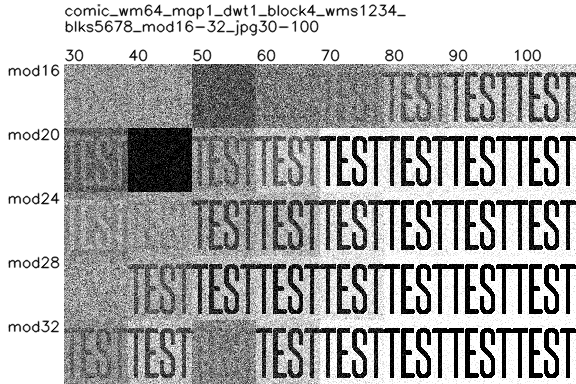
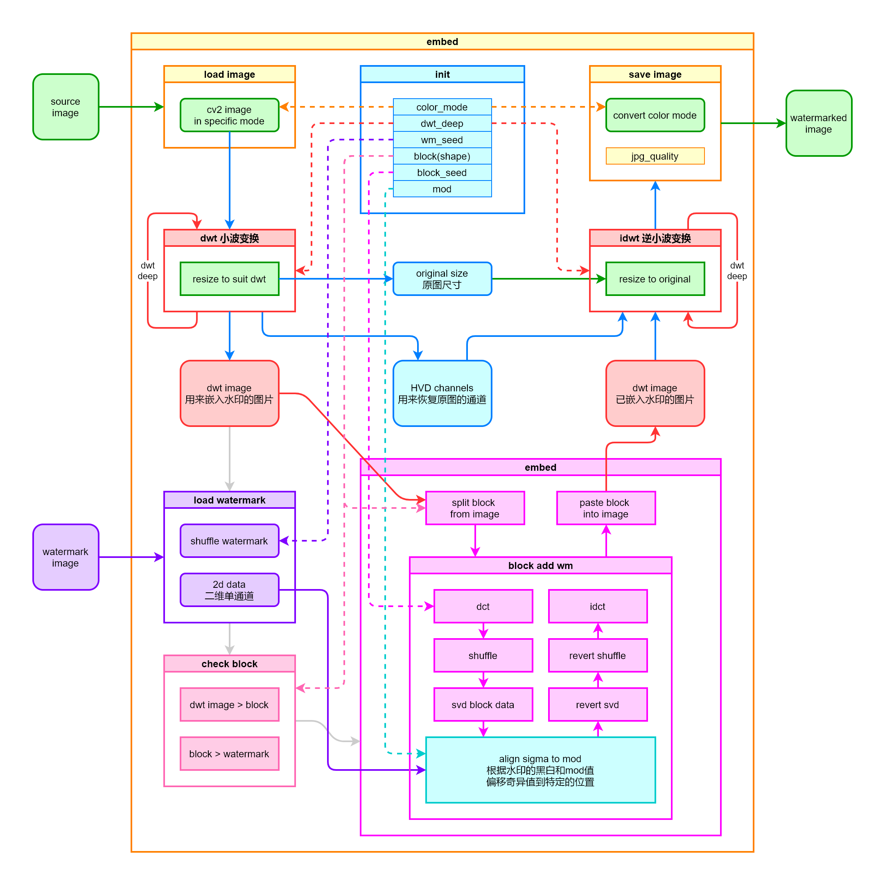
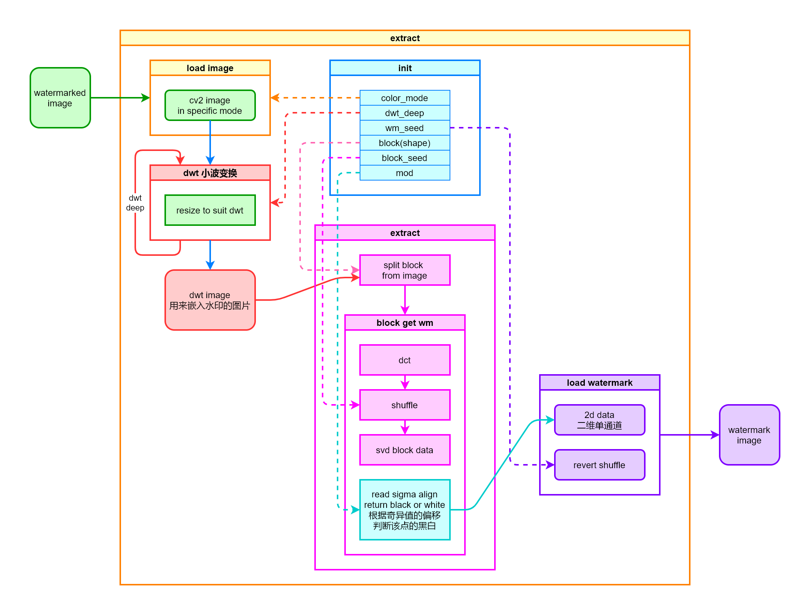

# Image Invisible Watermark 图片盲水印

## 1 项目简介

-   给图片添加不可见的水印。可以用来证明原图作者，或者寻找泄露源头。
-   对图片的改动极小，不影响原图品质。
-   可自定义两组密码，用来防破解和修改。

### 1.1 示例

-   原图（需要加水印的图）  
    
-   水印图  
    
-   用默认参数加水印后的效果，跟原图差异极小。  
    **合成图** = 原图 + 水印图  
    
-   从 **合成图** 取出的水印  
    

    > 水印图默认值我设定为 64×64 像素，应该是足以应付大部分场景。  
    > 比如你把图样交给某位客户，就可以在水印里记录自己的签名和该客户的编号。  
    > 或者直接用特殊数字，比如你的生日作为加密密码，从不同维度嵌入必要信息。

### 1.2 抵抗 JPG 压缩

> 其中的 mod 值在后面会解释，默认是用的 24。  
> 下面展示的是原图，及各种 jpg 画质和 mod 组合下水印还原的结果。

-   卡通图片  
    
    

> 大部分情况下，默认参数 mod24 抵抗 jpg50 的压缩没有问题。  
> 更多详细测试结果，[点这里](readme/test.md)。

## 2 源项目

本项目源自 [fire-keeper/BlindWatermark: 使用盲水印保护创作者的知识产权](https://github.com/fire-keeper/BlindWatermark)

### 2.1 原理解释

#### 加水印

> 这里 dwt 小波是一个可逆过程。  
>  嵌入水印时的奇异值分解 dct 和 svd 也是可逆的过程。  
>  水印嵌入主要是根据 mod，把 svd 的 sigma 值对齐到特定位置以表示对应点的黑白。

#### 解水印

## 3 改进的部分

-   **参数分离**  
    源算法有不少参数是载入原图和水印图时作为 self 变量加入的。比较难区分加水印和解水印过程中，各用到了哪些元素和参数。所以把各个函数用到的参数给分离厘清了一下。顺便把函数也给拆分了一下。现在代码会更易读一些。

-   **代码复用**  
    原算法大量使用 YUV 来表示各通道，但其实也有可能是 RGB，同时也导致了大量（各通道）重复的代码，所以现在把通道都放到了列表里，以简化代码，增加可读性。

-   **切图简化**  
    原算法分 block 时先切图后索引，过程比较复杂。现在大幅简化，直接在原图上操作，读取 block 的坐标以获得切片，混肴并贴回原坐标，省略了很多步骤。

-   **自动计算参数**  
    锁定水印为 64×64 像素时（仍可自行设定），自动计算原来需要设定的复杂参数，尽量满足大部分条件下的解水印鲁棒性，同时减少解水印时所需的参数（dwt_deep / block / wm_shape）。

    > 自动计算参数以短边优先，缺点是可能导致 block 过小。  
    > 但考虑到现在有很多长微博、条漫、商品详情等都是长图，且很有可能被截取使用，所以较小的 block 可以尽可能保证截取后的画面仍含有完整的水印信息。  
    > （但过小的窄长图输出的确会比较糟糕，可以手动设定参数。）

-   **水印映射**  
    原算法的 block 排序是横向平铺到底换行。增加了一组选项，让横向 block 对应水印横坐标，纵向 block 对应水印纵坐标。

## 4 参数说明

主文件是 `watermark.py`

### 4.1 init Class

> 这里全部可以使用默认参数，即不用输入任何参数。  
> 有些参数的作用位置，可以参考上面的原理图。

-   `wm_seed` 水印随机种子。`int` (0~4294967296)。默认 `None`，即不打乱水印排序。

-   `block_seed` block 随机种子。`int` (0~4294967296)。默认 `None`，即不打乱 block 排序。

-   `mod` 对齐除数。可传入 `int` 或 `tuple`(多次 mod)，默认 `24`。  
    这个值可以理解为最终图片改动的幅度。大部分情况下数值越大图片改动约明显，同时解水印效果越好。但具体还是因图而异。

-   `block` 分块的大小。接受 `int`，`tuple`(宽,高)，或者 `auto`。默认是 `auto`。目前仅支持宽高一致。

-   `dwt_deep` 小波变换次数。`int`，默认 `3` 。如果 `block="auto"` ，那后续如果图片过小可能自动降低本数值。

-   `color_mode` 水印嵌入使用的图像模式，可以是 `YUV` 或 `RGB` 。但测试下来大部分情况下 `YUV` 效果更好，所以默认是 `YUV` 。

-   `wm_map_method` 水印和 block 的映射方式。int，1=平铺，2=纵横分别映射。默认是 1。

> **这部分推荐自定义的是 `wm_seed` 和 `block_seed`**，这样可以防止别人查看你添加的水印，并且可以在这里嵌入特殊数字作为身份识别。

### 4.2 embed 加水印

> 这里为了防止误输入所以都用了命名关键字。

-   `src` 需要加水印的原图文件。

-   `wm` 水印图文件。

-   `output` 输出的合成图文件。如果使用了自带的 `format_filename` 函数，只要指定了输出格式，会自动生成包含各项参数的文件名，方便测试。详见 `watermark.py` 代码最下方。

-   `jpg_quality` (可选) JPG 压缩品质，默认 80。

### 4.3 extract 解水印

> 这里为了防止误输入所以都用了命名关键字。

-   `src` 需要解水印的图。

-   `output` 解码后导出的水印文件。同样可以由 `format_filename` 生成。

-   `wm_w` 和 `wm_h` (可选) 水印宽度和高度，默认 64。  
    如果 `wm_seed=None` 的话，其实用默认值 64 也可以解 32 或者 16 的水印，解出来是平铺在 64×64 的图内。但如果设定过 `wm_seed` 且水印不是默认值，这里就需要手动指定了。

-   `channel` (可选) 解码水印所选用的通道。`0` 是取所有通道平均。`1`、`2`、`3` 对应 `color_mode` 的通道。大部分情况下 `Y` 通道解水印效果最好，所以默认是 `1`。`None` 是把上述四种通道合成在一张图上输出，便于观察区别。

## 5 后记

前期只是想找个盲水印写法来用，刚好试到这个。原作者的方法和数学基础是远胜于我。

但整个项目弄下来，感觉是还有不少改善的可能性。比如现在不同类型的图适用的最优 mod 参数也不同，再比如防剪切部分能不能再优化，等等。后续抽空也会再看看其他的方法，希望能进一步优化看看。
