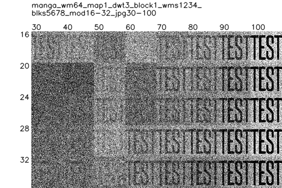

# 详细测试

## 0. 测试图一览

-   [lena512](../pic/lena512.png) 照片。
-   [mini512](../pic/mini512.png) 白底黑字的极简图片。
-   [mini512i](../pic/mini512i.png) 上面的反色，黑底白字。
-   [noy512](../pic/noy512.png) YUV 模式下 Y 为 255 的图片，即明度通道数值一致的图片。
-   [comic](../pic/comic.jpg) 卡通色块图。
-   [drama](../pic/drama.jpg) 影视剧截图。
-   [manga](../pic/manga.jpg) 黑白漫画。
-   [paint](../pic/paint.jpg) 彩色油画。

> 上述文件都在 `pic` 目录下。  
> 其中 `mini`、`noy`、`manga` 较为特殊，照片、剧照、油画其实比较类似。  
> 另外 `wm64` 是白底黑字水印，`wm64i` 是黑底白字水印。

## 1. jpg 压缩质量和 mod 值的关系

下面是用不同 jpg 和 mod 参数组合，加水印并解水印后的结果。

| name     | wm64                                                                             | wm64i                                                                             |
| -------- | -------------------------------------------------------------------------------- | --------------------------------------------------------------------------------- |
| lena512  |   |   |
| mini512  |   |   |
| mini512i |  |  |
| noy512   |    |    |
| comic    |     |     |
| drama    |     |     |
| manga    |     |     |
| paint    |     |     |

### 结论

-   一般情况下，jpg40 且 mod20 时会解出一个黑块。可能是刚好跟 jpg 压缩的参数冲突到。
-   极简黑白图的情况下，支持到 jpg60 没问题，再低就不行了。
-   noy 这种没有明度变化（或者明度变化极小的画面）会有几个缺口。
-   manga 这类复杂的黑白图，压缩之后也最多支持到 60。
-   mod 默认参数 24 基本是基于上述测试得出的，能覆盖大部分 jpg>=50 的情况。如果碰到上述特例，还是需要按需调整水印图和参数。
-   在大部分测试中，虽然解压效果 mod28 更好一些（一般来说 mod 数字越大，画面改动也就越大，解压效果越好），所以平衡了画面效果和水印效果，选了 24。

## 2. dwt_deep 和 block 的关系

### 2.1. 尽量让最终改动的块是 8 的倍数

从上级的 readme 中的流程图可以了解到

```
原图片边长 / 2^dwt_deep = 等待分块的图的边长
```

反过来

```
block边长 * 2^dwt_deep = 对应到原图的块的边长（final）
```

| deep1 block4 = final8                                                    | deep1 block2 = final4                                                    |
| ------------------------------------------------------------------------ | ------------------------------------------------------------------------ |
|  |  |

因为 jpg 压缩是按 8×8 为单位切图的，所以实际测试下来，**final 是 8 的倍数的时候，jpg 出图的画质更好**。如果卡不到 8 的倍数，那最终 block 越大出图效果越好。auto_block 函数也是按照这个逻辑工作的。

### 2.2. block 和 dwt_deep 的平衡

-   那么同样最终块是 8，也会有好几种组合，比如：
    ```
    block(1) * 2^dwt_deep(3) = 8
    block(2) * 2^dwt_deep(2) = 8
    block(4) * 2^dwt_deep(1) = 8
    ```
    选取哪种组合比较好呢？
-   因为最终有一个加水印取 mod 还原的动作，会有几个特性：
    -   block 越小，加水印后数值偏移越大，也就是画面差异和原图比更大。
    -   但差异更大，也意味着水印还原的时候，效果更加好一些。但同时比如 block1 的时候，svd 感觉准确度会变差，所以实际测试效果甚至可能更差。
    -   block 越大，计算量会大一点。
-   具体实验之后，发现解水印的效果提升比较有限。所以平衡下来，还是优先画质，优先选 block 大于等于 4 的参数组合。

| name     | deep1 block4                                                                     | deep3 block1                                                                     |
| -------- | -------------------------------------------------------------------------------- | -------------------------------------------------------------------------------- |
| lena512  |   |   |
| mini512  |   |   |
| mini512i |  |  |
| noy512   |    |    |
| comic    |     |     |
| drama    |     |     |
| manga    |     |     |
| paint    |     |     |

### 2.3. 运算量的考虑

-   因为最终要计算所有切分出的 block，所以数量越多，计算量越大。如果 block 固定为 4，假设 deep1 的情况下，final 就是 8。那么一张 1024 的正方形图的运算量就是 512 的 4 倍。这也是有些反馈会用到十几秒甚至数十秒的原因。
-   也就是说，block 越多，multiple 数值越大，解水印效果越好，但加水印解水印需要的时间越长。
-   通过测试，64×64 的水印图，用 128×128 个 block 来记录（边长 2 倍），还原效果就足以应付大多数情况。同时更小的水印，比如 32×32，也是用 128×128（边长 4 倍），还原效果足以应付大多数情况。在 auto_block 函数里，我有放一个参数 mutiple 来表示这个倍数，默认值是 4。当这个参数小于 1，也就意味着 block 数不足以记录水印（本来还考虑过自动缩水印的方案，但发现 64×64 足够应付大多数情况了，好像没必要搞太复杂）。

| name     | deep0                                                                      | deep1                                                                      |
| -------- | -------------------------------------------------------------------------- | -------------------------------------------------------------------------- |
| lena512  |   |   |
| mini512  |   |   |
| mini512i |  |  |
| noy512   |    |    |
| comic    |     |     |
| drama    |     |     |
| manga    |     |     |
| paint    |     |     |

-   虽然 multiple>=4 时，可以应付到 jpg30 这样的高压缩率的图片，但对应的代价就是 block 过多，对应的问题就是画质下降（final<8）和计算时间变长。
-   所以平衡各种因素，默认值还是选 jpg50 时适用的参数，一般 m>=2 就可以应付大部分情况。
